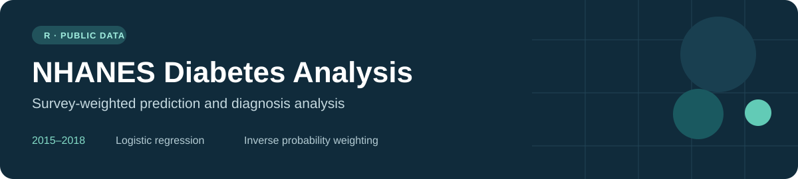
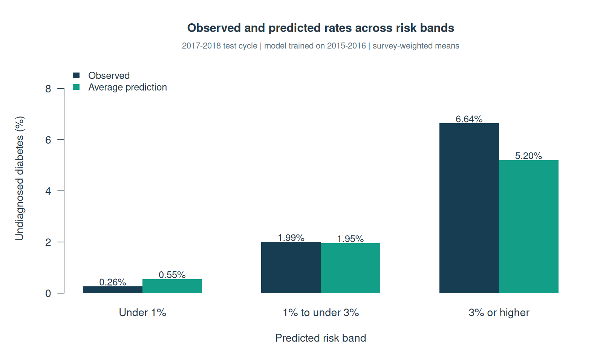
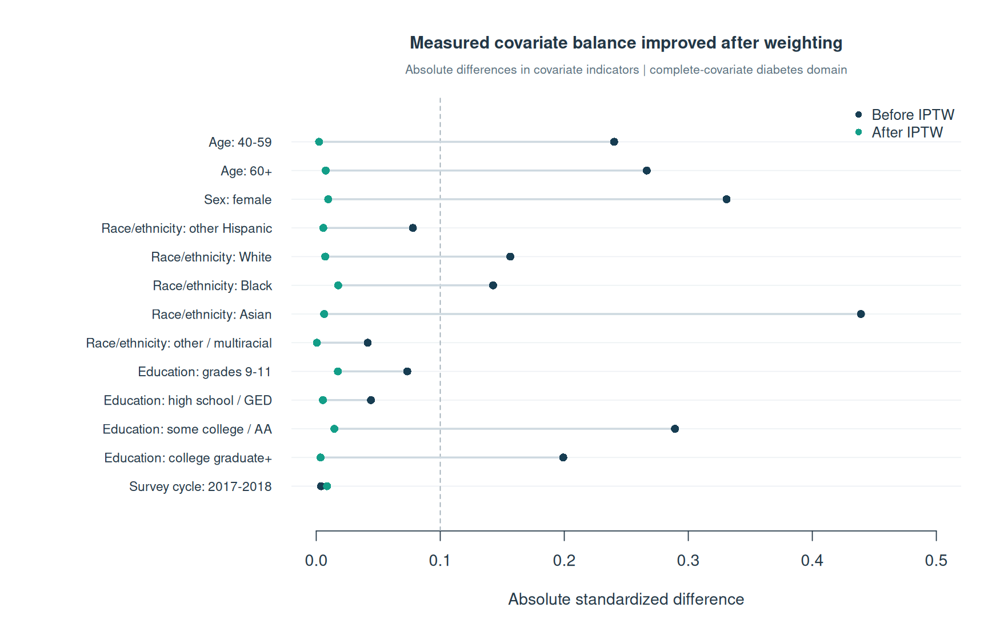

**An R project by Jack Janik** exploring undiagnosed diabetes and diagnosis differences with public NHANES data.

[Overview](#overview) · [Methods](#methods) · [Results](#results) · [Run the analysis](#run-the-analysis) · [Data](data/raw/README.md)

## Overview

This three-week academic project uses the **2015-2016 and 2017-2018 NHANES cycles** to answer two questions:

1. **Undiagnosed diabetes:** How do age, recorded sex, and BMI relate to laboratory-defined undiagnosed diabetes among adults without a reported diagnosis?
2. **Diagnosis differences:** Among adults classified as having diabetes, how do reported diagnosis rates differ between BMI groups after adjustment for measured demographic factors?

The project covers data integration, outcome construction, complex survey analysis, logistic regression, assessment on a later survey cycle, and inverse probability weighting (IPTW).

## Methods

| Analysis | Approach |
|---|---|
| Data preparation | Join demographics, diabetes questionnaire, body measurements, and HbA1c by `SEQN`; append two survey cycles |
| Survey design | MEC examination weights, strata, and PSUs; build the full examined design before selecting adult domains |
| Prediction | Survey-weighted logistic regression with age group, recorded sex, and BMI |
| Prediction assessment | Train on 2015-2016; compare predicted probabilities with observed outcomes in 2017-2018 risk bands |
| Sensitivity analysis | Repeat the prediction model after excluding borderline diagnosis responses |
| Diagnosis comparison | Stabilized IPTW combined with survey weights; inspect propensity scores and covariate balance |

**Outcome construction:** a reported diagnosis (`DIQ010 = 1`) defines the diagnosed group. For respondents reporting no or borderline diagnosis (`DIQ010 = 2 or 3`), HbA1c (`LBXGH`) of at least 6.5% defines the undiagnosed group; lower HbA1c defines the study's "No diabetes" comparison group. These are operational study labels, not individual clinical diagnoses.

**Leakage control:** HbA1c establishes the outcome but is excluded from the prediction model. Diagnosis responses and derived diabetes labels are also excluded as predictors. The model uses only age group, sex, and BMI.

More detail: [analysis notes and limitations](docs/methods.md).

## Results

The following figures come from the saved original analysis. They are recorded in [original results](results/original_results.md); new runs write their own tables to `results/generated/`.

| Finding | Original result |
|---|---|
| Adjusted diagnosis difference: BMI >=30 minus BMI <30 | **-6.44 percentage points** |
| 95% confidence interval for that difference | **-11.86 to -1.02 percentage points** |
| Largest absolute standardized covariate difference | **0.44 before IPTW → approximately 0.02 after** |
| Complete-covariate sample for the IPTW analysis | **1,934 adults** |

In the original 2017-2018 prediction check, observed undiagnosed diabetes rates increased across predicted risk bands: **0.263%, 1.994%, and 6.639%**. These are observed survey-weighted rates within the three bands, not classification accuracy.





The figures above were regenerated from public CDC inputs on October 1, 2026. The clean pipeline reproduced the original prediction-band estimates and the IPTW diagnosis difference to the precision displayed here.

See the [reproduction check](docs/validation.md) for the tested R/package versions and numerical checks.

**Interpretation:** the diagnosis result is an exploratory adjusted association. NHANES is cross-sectional, BMI may change after diagnosis, and restriction to participants with diabetes may introduce selection bias. Good balance on measured variables does not establish causality.

## Run the analysis

Requirements: **R**, the `haven`, `dplyr`, and `survey` packages, and internet access for the initial public-data download. RStudio is optional.

In RStudio, open the repository folder as your working directory and run:

```r
install.packages(c("haven", "dplyr", "survey")) # First setup only
source("scripts/run_all.R")
```

To run individual stages:

```r
source("scripts/00_download_data.R")
source("scripts/01_prepare_data.R")
source("scripts/02_prediction.R")
source("scripts/03_iptw.R")
source("scripts/04_visualize.R")
```

From a terminal with R installed and the packages available, use `Rscript scripts/run_all.R` from the repository folder.

The download script reuses existing readable XPT files. If CDC downloads fail, use the [manual download links](data/raw/README.md) and then run stages 01-03.

### Outputs

- **Processed data:** the full survey frame, merged adult dataset, and a prediction subset under `data/processed/`.
- **Prediction:** odds ratios and confidence intervals, age-group estimates, example profiles, and test-cycle risk-band summaries.
- **IPTW:** sample counts, covariate balance, diagnosis proportions, and the adjusted difference with its confidence interval.
- **Run record:** `session_info.txt` records the R and package versions used by `run_all.R`.
- **Overview figures:** the two aggregate PNG charts in `results/figures/` are rebuilt by stage 04.

Raw data, derived participant datasets, and numeric run outputs are generated locally and excluded from Git. The aggregate overview figures are tracked for display in this README; recorded original results remain available in Markdown.

## Repository guide

| File or folder | Purpose |
|---|---|
| [`scripts/00_download_data.R`](scripts/00_download_data.R) | Retrieve and validate public XPT files |
| [`scripts/01_prepare_data.R`](scripts/01_prepare_data.R) | Merge components, define labels, and preserve survey variables |
| [`scripts/02_prediction.R`](scripts/02_prediction.R) | Fit the model and assess predictions across survey cycles |
| [`scripts/03_iptw.R`](scripts/03_iptw.R) | Estimate propensity weights, check balance, and compare diagnosis |
| [`scripts/04_visualize.R`](scripts/04_visualize.R) | Rebuild the two aggregate overview figures |
| [`docs/methods.md`](docs/methods.md) | Outcome definitions, exclusions, assumptions, and limitations |
| [`results/original_results.md`](results/original_results.md) | Selected results from the original project |
| [`data/raw/README.md`](data/raw/README.md) | CDC source links and manual download instructions |

## Sources

- [CDC NHANES datasets and documentation](https://wwwn.cdc.gov/nchs/nhanes/continuousnhanes/)
- [NHANES sample design](https://wwwn.cdc.gov/nchs/nhanes/tutorials/SampleDesign.aspx)
- [NHANES weighting](https://wwwn.cdc.gov/nchs/nhanes/tutorials/weighting.aspx)
- [NHANES variance estimation](https://wwwn.cdc.gov/nchs/nhanes/tutorials/varianceestimation.aspx)
- [NHANES estimate reliability](https://wwwn.cdc.gov/nchs/nhanes/tutorials/reliabilityofestimates.aspx)
- [R survey package: svyglm](https://search.r-project.org/CRAN/refmans/survey/html/svyglm.html)
